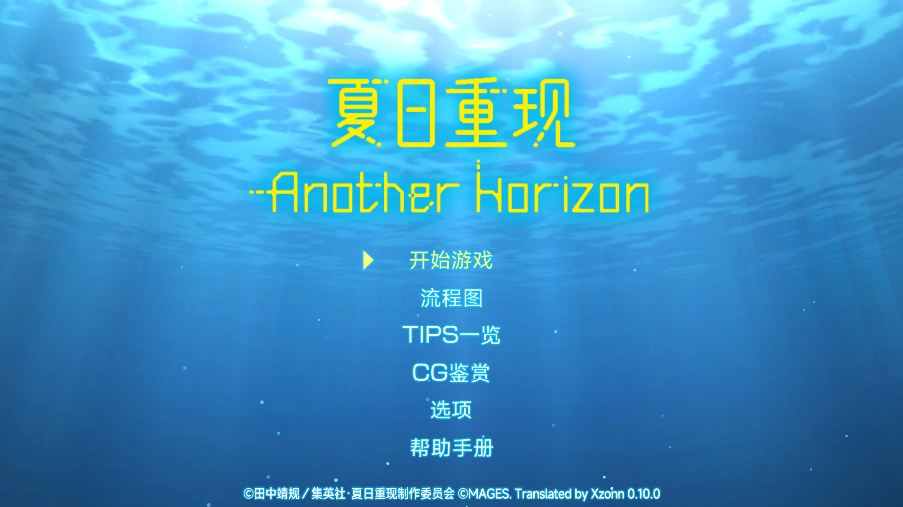
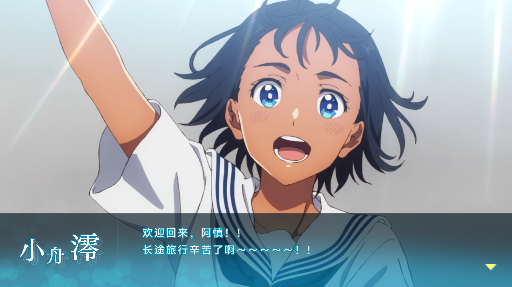

# [《夏日重现 Another Horizon》汉化](https://xzonn.top/STRAHChsLocalization/)

## 基本说明
**注意：本补丁仅用作技术交流，请用于正版游戏。**

本项目是对《夏日重现 Another Horizon》（サマータイムレンダ Another Horizon）的简体中文本地化。

游戏中的文本根据 [哔哩哔哩漫画](https://manga.bilibili.com/detail/mc28500)、[哔哩哔哩番剧](https://www.bilibili.com/bangumi/play/ss41417)、[萌娘百科](https://zh.moegirl.org.cn/%E5%A4%8F%E6%97%A5%E9%87%8D%E7%8E%B0) 等平台对人名、地名等专有名词进行翻译。

**由于精力和技术所限，暂时没有对图片形式的文本进行翻译。这些文本包括帮助界面、对话时的人名、即时动作选项、部分操作按钮等。游戏中的所有对话、提示、章节介绍已经完全翻译，不会对剧情理解造成障碍。**

本补丁基于 Nintendo Switch 版制作，无法直接用于其他平台版本。

## 使用方式
需要一台能够运行 [Atmosphere](https://github.com/Atmosphere-NX/Atmosphere) 自制固件（CFW）的 Nintendo Switch 主机。请下载 [补丁](https://github.com/Xzonn/STRAHChsLocalization/releases/latest/) 并解压，然后将`01005940182ec000`文件夹移动到到`SD:/atmosphere/contents/`文件夹下。

## 截图预览
  
  

## 相关链接
- **[>>> 补丁下载地址 <<<](https://github.com/Xzonn/STRAHChsLocalization/releases/latest/)**
- [补丁生成工具](https://github.com/Xzonn/STRAHChsLocalizationHelper)
- [预览视频](https://www.bilibili.com/video/BV1gP411r7kr/)

## 授权协议
本项目使用 **[CC BY-NC-SA 4.0](https://creativecommons.org/licenses/by-nc-sa/4.0/legalcode)** 协议授权。若您想基于本项目进行二次创作，请遵守协议内容。这些内容主要包括：

- **署名**：您必须标明本项目的作者（Xzonn），并在您的作品中提供指向本项目的链接。
- **非商业性使用**：您不得将本项目用于商业目的。
- **相同方式共享**：若您基于本项目进行二次创作，您必须以相同的协议授权您的作品。

请阅读本项目的 **[完整授权协议](LICENSE)** 以了解更多信息。
